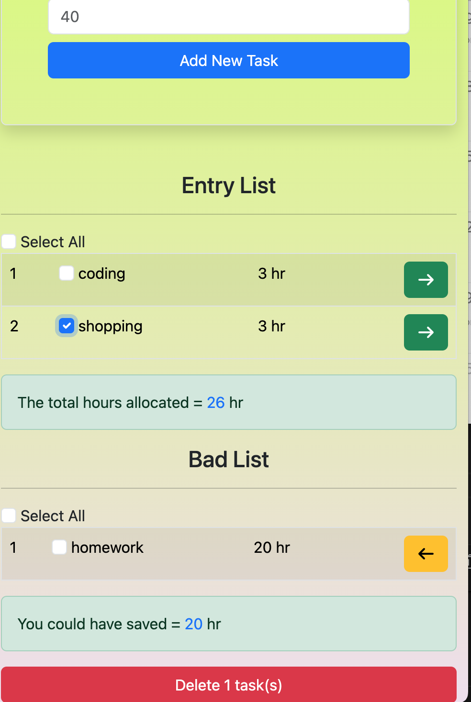

# RESTFull API CRUD

Welcome to the REST API CRUD.
This project is used for testing API create,read,update and delete data
which send request from API to server express.js



## Table of Contents

- [Introduction](#introduction)
- [Features](#featuers)
- [Technoloies Used](#technologies-used)
- [How to Use](#how-to-use)
- [Usage](#usage)
- [Project Structure](#project-structure)
- [Contributing](#contributing)
- [License](#license)
- [Contact](#contact)

## Introduction

This project is build with React JS,Node.js+express.js, MongoDB and deployed via GitHub.

[Visit Live Website](https://movie-world-sooty.vercel.app/)

## Featuers

- **Responsive Design**:

## Technologies used

- ## **Frontend**:
  - REACT JS,HTML, CSS, Bootstrap and Javascript
- **REST API**:
  - Postman for tesing
  - REST extention install in VS-code
- **Backend**:
  - Node.js, express.js
- **Database**:
  - MongoDB
- ## **Deployment**

## How to use?

To set up this project in your device locally, please follow the steps:

1.  **Clone the respository**:
    run the following command in your terminal:
    > ```
    >   git clone https://github.com/yadin-nou/api
    > ```
2.  **Navigate to the project directory**:
    > ```
    >   cd yadin-nou
    > ```
3.  **Install Dependencies**:
    > ```
    >   yarn add express.js
    >   yarn add nodemon
    >   yarn add moongoose
    >   yarn add morgan (for http request logger)
    > ```
4.  **Run the development server**:
    > ```
    >   yarn dev
    > ```

## Usage

## Project Structure

```
movie-world
|-- public
|-- src
| |-- config
| | |-- db.Config.js
| |-- models
| | |-- taskSchema.js
| |-- router
| | |-userRouter.js
```

## Contributing

## License

## Contact
